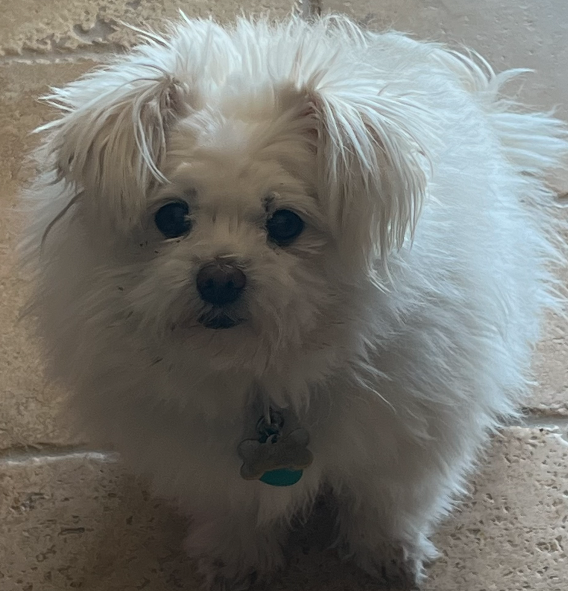

[Pictures1]: <>


</br>

[Pictures2]: <>


[Heading]: <>
# Joanna Yang

[Styling text]: <>
*Third year, CS major, UCSD*

[Quoting text]: <>
> I have a dog

[Quoting code]: <>
```
Fun fact about my dog: although she looks like a baby, she is 16 years old already.
```

[External Links]: <>
I wish one day I can have the ability to adopt a cat [cool adoption link](https://www.petsmart.com/adoption/people-saving-pets/ca-adoption-landing.html)

[Section Links]: <>
Go back to the [top](https://github.com/joy002/CSE110/blob/main/index.md#joanna-yang)

[Relative links(Link to another .md file or an image in your repo. If linking to an image, encode it as a regular link rather than an image.)]: <>
[README.md](https://github.com/joy002/CSE110/blob/main/README.md)

[Ordered Lists]: <>
Some classes I still need to take before graduation:
- CSE 120
- CSE 132A
- CSE 127

[Ordered Lists]: <>
Some countries I want to travel:
1. Korea
2. Japan
3. France

[Task lists]: <>
- [x] wake up
- [ ] eat breakfast
- [ ] go to school

introduces who you are as a programmer and as a person. Your User Page must be made with Markdown.

Section links
